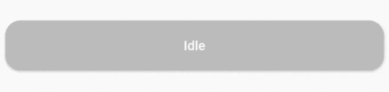

# Progress State Button

A customizable progress button for Flutter


 


## Installation

https://pub.dev/packages/flutter_state_button

```
progress-state-button: "^1.0.0"
```

## Usage

### Icon 


```
ProgressButton.icon(iconedButtons: {
      ButtonState.idle:
        IconedButton(
            text: "Send",
            icon: Icon(Icons.send,color: Colors.white),
            color: Colors.deepPurple.shade500),
      ButtonState.loading:
        IconedButton(
            text: "Loading",
            color: Colors.deepPurple.shade700),
      ButtonState.fail:
        IconedButton(
            text: "Failed",
            icon: Icon(Icons.cancel,color: Colors.white),
            color: Colors.red.shade300),
      ButtonState.success:
        IconedButton(
            text: "Success",
            icon: Icon(Icons.check_circle,color: Colors.white,),
            color: Colors.green.shade400)
    }, 
    onPressed: onPressed,
    state: ButtonState.idle);
```

### With Custom Widgets 


```
ProgressButton(
      stateWidgets: {
        ButtonState.idle: Text("Idle",style: TextStyle(color: Colors.white, fontWeight: FontWeight.w500),),
        ButtonState.loading: Text("Loading",style: TextStyle(color: Colors.white, fontWeight: FontWeight.w500),),
        ButtonState.fail: Text("Fail",style: TextStyle(color: Colors.white, fontWeight: FontWeight.w500),),
        ButtonState.success: Text("Success",style: TextStyle(color: Colors.white, fontWeight: FontWeight.w500),)
      },
      stateColors: {
        ButtonState.idle: Colors.grey.shade400,
        ButtonState.loading: Colors.blue.shade300,
        ButtonState.fail: Colors.red.shade300,
        ButtonState.success: Colors.green.shade400,
      },
      onPressed: onPressed,
      state: ButtonState.idle,
    );
```

### Constructors

Default constructor of ProgressButton

`stateWidgets` - Widgets of states
`stateColors` - Background color oof states
`state = ButtonState.idle` - Current state of button
`onPressed` - onPressed function same like RaisedButton
`onAnimationEnd` - onAnimatedEnd function calls like that onAnimatedEnd(AnimationStatus animationStatus,ButtonState currentState).
`minWidth = 200.0` - Loading state width
`maxWidth = 400.0` - failed,success,idle states width
`radius = 16.0` - Button radius
`height = 53.0` - Button height
`circularProgressIndicator` - CircularProgressIndicator widget, default is instating with current state color.
`progressIndicatorAligment = MainAxisAlignment.spaceBetween` - ProgressIndicator aligment
`padding = EdgeInsets.zero` - Padding of button

ProgressButton.icon() specific constructors

`@required Map<ButtonState, IconedButton> iconedButtons` - State and IconedButton map
`double iconPadding: 4.0` - Padding of icon 
`TextStyle textStyle` - TextStyle of all of states

## License
This project is licensed under the MIT License - see the [LICENSE.md](LICENSE.md) file for details